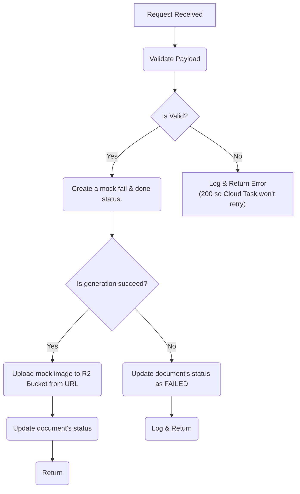
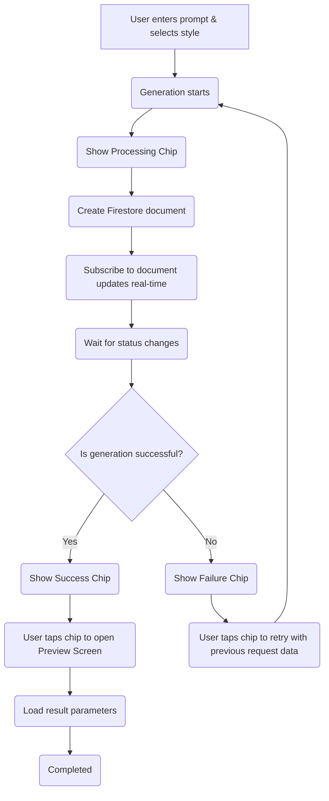

## 1. Installation

- Clone this repository to your local by using: `git clone git@github.com:muzakon/feraset-case-study.git`
- On the root directory, run `make initialize` or you must pull submodules manually
- We need to install depencies for React Native. Visit `frontend` folder and use `yarn` or `npm install`
- Visit `backend/src` and create a fresh virtual environment . After that, once your virtual environment is active, install depencies from `requirements.txt`

**Environment Variables**

1. Create a file called `.env` inside `frontend` folder.

```
EXPO_PUBLIC_FIREBASE_API_KEY="YOUR_FIREBASE_API_KEY"
EXPO_PUBLIC_FIREBASE_AUTH_DOMAIN="YOUR_FIREBASE_AUTH_DOMAIN"
EXPO_PUBLIC_FIREBASE_PROJECT_ID=  "YOUR_FIREBASE_PROJECT_ID"
EXPO_PUBLIC_FIREBASE_APP_ID="YOUR_FIREBASE_APP_ID"
EXPO_PUBLIC_TEST_MODE="TRUE_OR_FALSE"
```

2. Create a file called `.env` inside `backend/src` folder.

```
GCP_PROJECT_ID="GCP_FIREBASE_PROJECT_ID"
QUEUE_NAME="GCP_CLOUD_TASKS_QUEUE_NAME"
QUEUE_LOCATION="GCP_CLOUD_TASKS_QUEUE_LOCATION"
WEBHOOK_URL="GCP_ON_CALLBACK_FUNCTION_PUBLIC_URL"
COLLECTION_NAME="FIREBASE_COLLECTION_NAME"
R2_ACCESS_KEY_ID="CLOUDFLARE_R2_STORAGE_KEY_ID"
R2_SECRET="CLOUDFLARE_R2_STORAGE_SECRET"
R2_BUCKET_NAME="CLOUDFLARE_R2_STORAGE_BUCKET_NAME"
R2_API_URL="CLOUDFLARE_R2_STORAGE_API_URL"
R2_PUBLIC_URL="CLOUDFLARE_R2_STORAGE_PUBLIC_DEV_API_URL"
R2_REGION="CLOUDFLARE_R2_STORAGE_REGION"
```

I recommend to use my credentials i shared by visiting the following Notion document.
https://www.notion.so/Credentials-2c0ae52f6a0e8060b2faefdfab81e715

You are ready to start React Native app now. Visit `frontend` folder and use `npm run start` or `yarn start` to start the app.

## 2. Architecture

#### - 2.1. Backend (Cloud Functions)

- I have two functions. `on_generation_created` and `on_callback` (I simulated a callback like a real-world application as you mentioned in case-study.)
- `on_generation_created` handles the event after the document is generated in Firestore collection. It basically schedules a task to **send request** to **on_callback** function by using **Google Cloud Tasks** with given payload.

Payload example (In a real world product, there could be much more information such as model-id, task-id, user-id etc):

```
{
	"generation_id": generation_id
}
```

- **on_callback** function handles the **POST** request that Task triggers after being dispatched on Google Cloud Task queue.



#### - 2.2. Frontend (React Native)

1. Generation Screen

- This screen allows the user to **create a new generation task**.
- The user enters a **prompt** and optionally selects a **style**.
- Alternatively, the user may tap **“Surprise Me”** to auto-generate a mock prompt for logo creation.
- The **Create** button remains **disabled** until a valid prompt is provided.
- When the user taps **Create**, the following workflow begins:

2. Preview Screen

If the user taps the Success Chip, they are navigated to the Preview Screen, which displays:

- The generated image
- The prompt & style parameters



---

## 3. Changes I made && Assumptions

- I created a Google Cloud Task queue which is not mentioned in your case-study.
- I used simple prints for logging errors etc. in Cloud Functions. It annoys me but otherwise I need to install GCP's Logging libraries etc. I'd to it in real-world application to make logs seem like in real log structure.
- I created an X button at right most of prompt area's counter, since its not shown in Figma but added to template. This button resets user's prompt.
- I added Pydantic for .env management in Cloud Functions.
- I created a method called "is_failed" in my Python code. This method decides randomly if the generation is done or failed. By default, its failed by 30% chance.
- I created a makefile to run useful commands easier in frontend & root directory. In frontend, make lint, make test, make check-all, make type-check etc. added
- I created a Document model such as:

```
{
  "createdAt": 1764936910,
  "prompt": "a flat vector leaf logo made of layered triangles, eco-friendly branding vibe, soft green gradient",
  "result": "https://pub-b6134a7102954fd8806805eae16759c3.r2.dev/logo-generations/6d6fb49b-a2df-47ad-b29b-2a3f43dceb2b.jpeg",
  "status": "DONE",
  "style": "no-style",
  "userId": "6931a52e-40f8-8330-9e77-bb46d496e273"
}
```

## 4. Known Limitations & things I'd like to improve

1. I'd like to use **Redux** as a storage in React Native app, its not always useful, but it could be useful in this case-study since we want to preview the generated image & used params etc. Right now it visits Preview screen by sending router params.
2. I'm not sure but maybe a React like middleware could be used for not allowing users to visit Preview screen somehow if not meeting requirements. (Because I don't know if screens are exposed by default somehow, like each router page is reachable on web by default)
3. I created **Maestro** as its described an extra on case study document, however, i could not manage launch arguments or environment variables to specify that we are on Test stage or Dev stage. Right now I manually play with `EXPO_PUBLIC_TEST_MODE` on .env. This could be good for testing easier.
4. On iOS, hideKeyboard not always working well on Maestro. https://docs.maestro.dev/troubleshooting/known-issues#hidekeyboard-command-is-flaky
5. There is a white flash problem which i could not solve on iOS. It seems like its a known bug and not fixed yet: https://github.com/expo/expo/issues/39969 It happens on Dark mode. (Burada yeni tarihli comment atılmış fixlendiğine dair ancak yeni release çıkılmış mı bakmadım. )
6. I haven't created a well-structured theme. It could be better to update it based on App dimensions (Like using fontSize: dimension.md, instead of fontSize: 16) however, since its not designed etc. on Figma, i didn't pay attention.
7. Maestro only tested on iOS.
8. No **EAS build & Configuration**
9. Maestro is not added to CI. I'd like to implement it but due to launch arguments & environment problem, i wanted to skip. I'd like to implement it if i had more time.)

## 5. Screen Recordings

1. App Demo: https://drive.google.com/file/d/1wsptiRx16yAvKU0xPLxr5yKZC5h4wxQT/view?usp=drive_link
2. Installation: https://drive.google.com/file/d/1h5DvYjuZxvq1RK9HxCmC_Fjq0hz46xAC/view?usp=drive_link
3. Test with Maestro: https://drive.google.com/file/d/1SHY8TTPlcrlPAWwEECPpImbN7sXFwPjl/view?usp=drive_link
